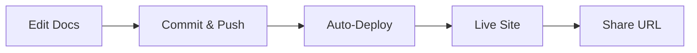

## Overview

Liveanimations provides a comprehensive platform for managing your project documentation. You can organize content hierarchically, collaborate with teams using version control, customize appearances with your brand colors like `#3B82F6`, and publish sites effortlessly. These features streamline your workflow from creation to sharing.

<Columns cols={2}>
  <Card title="Organize Docs" icon="folder" href="#organizing">
    Structure your content with folders and pages.
  </Card>
  <Card title="Collaborate" icon="users" href="#collaboration">
    Work with teams using version history.
  </Card>
  <Card title="Customize" icon="palette" href="#customization">
    Apply brand colors and themes.
  </Card>
  <Card title="Publish" icon="globe" href="#publishing">
    Share live documentation sites.
  </Card>
</Columns>

## Organizing and Structuring Docs

Create a clear hierarchy for your documentation using folders and nested pages. You start by setting up a root folder, then add subfolders for guides, APIs, and FAQs.

<Steps>
  <Step title="Create Root Folder" icon="folder">
    In the dashboard, click "New Folder" and name it `docs`.
  </Step>
  <Step title="Add Pages" icon="file-text">
    Inside `docs`, create pages like `introduction.mdx` and `quickstart.mdx`.
  </Step>
  <Step title="Nest Content" icon="chevron-down">
    Drag pages into subfolders for `guides/` and `reference/`.
  </Step>
</Steps>

This structure ensures intuitive navigation for users.

## Collaboration and Version Control

Liveanimations integrates Git for seamless teamwork. You commit changes, review diffs, and revert if needed.

<Tabs>
  <Tab title="Git Workflow" icon="git-branch">
    Push changes to your repo:
    
````bash
git add .
git commit -m "Update features docs"
git push origin main
````

    Liveanimations auto-deploys on push.
  </Tab>
  <Tab title="Review Changes" icon="eye">
    Use the preview panel to compare versions before merging.
  </Tab>
</Tabs>

<Callout kind="tip">
  Enable branch protection to require reviews on main branch.
</Callout>

## Customization Options

Tailor your docs with custom themes. Set your brand color `#3B82F6` via configuration.

<CodeGroup tabs="MDX Config,CSS Vars">
  ```javascript
  // config/theme.js
  export default {
    colors: {
      primary: '#3B82F6'
    }
  };
  ```
  ```css
  /* styles/global.css */
  :root {
    --brand-color: #3B82F6;
  }
  
  .header {
    background-color: var(--brand-color);
  }
  ```
</CodeGroup>

Upload logos and adjust typography for a branded look.

<Expandable title="Advanced Theming" default-open="false">
  Integrate custom fonts by adding to your `head`:
  
````html
<link href="https://fonts.googleapis.com/css2?family=Inter:wght@400;600&display=swap" rel="stylesheet">
````
</Expandable>

## Publishing and Sharing

Deploy your docs to a custom domain in one click. You generate a live URL like `docs.yourproject.com`.

<Steps>
  <Step title="Connect Domain" icon="link">
    Go to Settings > Domains and add your domain.
  </Step>
  <Step title="Deploy" icon="rocket">
    Click "Publish" – your site goes live instantly.
  </Step>
  <Step title="Share" icon="share">
    Copy the URL or embed via iframe.
  </Step>
</Steps>



<Callout kind="success">
  Changes propagate in `<1s` for instant updates.
</Callout>

These core features empower you to build professional documentation efficiently.