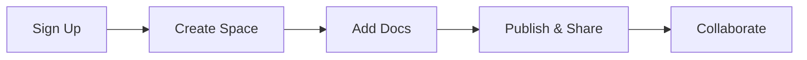

## Overview

Liveanimations empowers you to create, organize, and manage all your project documentation in one centralized space. You get a fully customizable documentation hub that scales with your team, supports real-time collaboration, and integrates seamlessly with your development workflow. Whether you document APIs, user guides, or internal wikis, Liveanimations handles it all with intuitive tools and powerful features.

## Key Features

Liveanimations stands out with its core capabilities designed specifically for documentation management.

<Columns cols={3}>
  <Card title="Version Control" icon="git-branch" href="#version-control">
    Track changes, revert updates, and maintain history for every document with built-in Git-like versioning.
  </Card>
  <Card title="Real-Time Collaboration" icon="users" href="#collaboration">
    Invite team members to edit simultaneously, add comments, and resolve conflicts effortlessly.
  </Card>
  <Card title="Custom Themes" icon="palette" href="#themes">
    Apply your brand colors like `#3B82F6` and customize layouts to match your project's identity.
  </Card>
</Columns>

## Benefits for Teams and Projects

You save time by streamlining documentation workflows, reducing silos, and ensuring everyone accesses the latest information. Teams report 40% faster onboarding and fewer errors from outdated docs. Projects benefit from searchable knowledge bases, automated deployments, and analytics on doc usage.

<Callout kind="tip">
  Start small: Begin with a single project space and expand as your needs grow.
</Callout>

<Expandable title="Advanced Benefits" default-open="false">

For enterprise teams, Liveanimations offers role-based access control, audit logs, and SSO integration. Solo developers appreciate the free tier with unlimited pages and custom domains.

</Expandable>

## Quick Start

Get up and running in minutes with these steps.

<Steps>
  <Step title="Create Account" icon="user-plus">
    Visit `https://liveanimations.com` and sign up with your email or GitHub account.
  </Step>
  <Step title="Set Up Space" icon="folder">
    Create a new documentation space for your project and invite collaborators.
  </Step>
  <Step title="Add Your First Doc" icon="file-plus">
    Upload Markdown files or use the visual editor to draft content.
  </Step>
  <Step title="Publish" icon="globe">
    Deploy your site with one click and share the live URL.
  </Step>
</Steps>

Here's a simple code example to embed Liveanimations docs in your app:

<CodeGroup tabs="JavaScript,React">
  ```javascript
  const embedDocs = (docId) => {
    const iframe = document.createElement('iframe');
    iframe.src = `https://docs.liveanimations.com/embed/${docId}`;
    iframe.width = '100%';
    iframe.height = '600';
    document.body.appendChild(iframe);
  };

  embedDocs('your-project-docs');
  ```
  ```jsx
  import { useEffect } from 'react';

  const DocsEmbed = ({ docId }) => {
    useEffect(() => {
      const iframe = document.createElement('iframe');
      iframe.src = `https://docs.liveanimations.com/embed/${docId}`;
      iframe.style.width = '100%';
      iframe.style.height = '600px';
      document.body.appendChild(iframe);
    }, [docId]);

    return <div id="docs-embed" />;
  };
  ```
</CodeGroup>

## Quick Navigation

Jump to the most relevant sections to accelerate your workflow.

<Columns cols={2}>
  <Card title="Quickstart Guide" icon="rocket" href="/quickstart">
    Set up your first documentation site.
  </Card>
  <Card title="Authentication" icon="lock" href="/authentication">
    Secure your docs with API keys and OAuth.
  </Card>
  <Card title="Customization" icon="settings" href="/configuration">
    Tailor themes and layouts.
  </Card>
  <Card title="Collaboration" icon="messages-square" href="/collaboration">
    Team editing and reviews.
  </Card>
</Columns>



<Callout kind="success">
  Ready to dive deeper? Check the <a href="/quickstart">Quickstart</a> next.
</Callout>